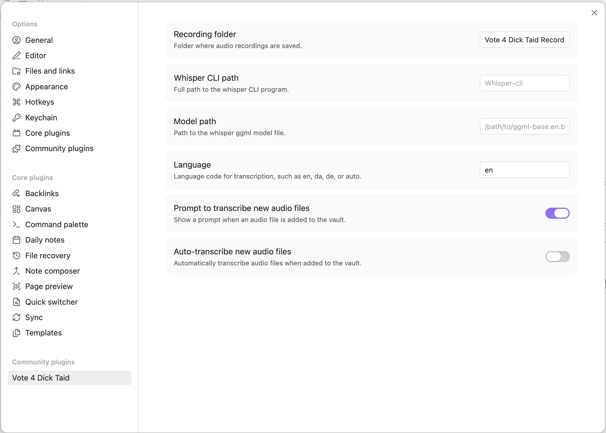

# Vote 4 Dick Taid
Obsidian plugin for dictating and transcribing audio files using locally installed `whisper-cli`. No calls to external services - it all runs locally on your machine.

[](https://www.buymeacoffee.com/woller)

## Installation
Add the plugin

You need to have whisper-cli installed and a model downloaded

### MacOS
#### Install `whisper-cli`
Using Homebrew:
```bash
brew install whisper-cpp
```

This installs the whisper-cli binary in `/opt/homebrew/bin/whisper-cli`.


#### Download a model
[Any model from this list](https://huggingface.co/ggerganov/whisper.cpp/tree/main) can be used. Or just [grab the default](https://huggingface.co/ggerganov/whisper.cpp/resolve/main/ggml-base.en.bin?download=true).

Put this somewhere like `/Users/[your username]/models`.

#### Configuration



Whisper CLI path: Point this to the `whisper-cli` binary, default `/opt/homebrew/bin/whisper-cli` when installing with homebrew.

Model path: Point this to the model, you downloaded previously, e.g. `/Users/[your username]/models/ggml-base.en.bin`.


## Shoutouts
Whisper-cli is from [whisper-cpp](https://github.com/ggml-org/whisper.cpp)
